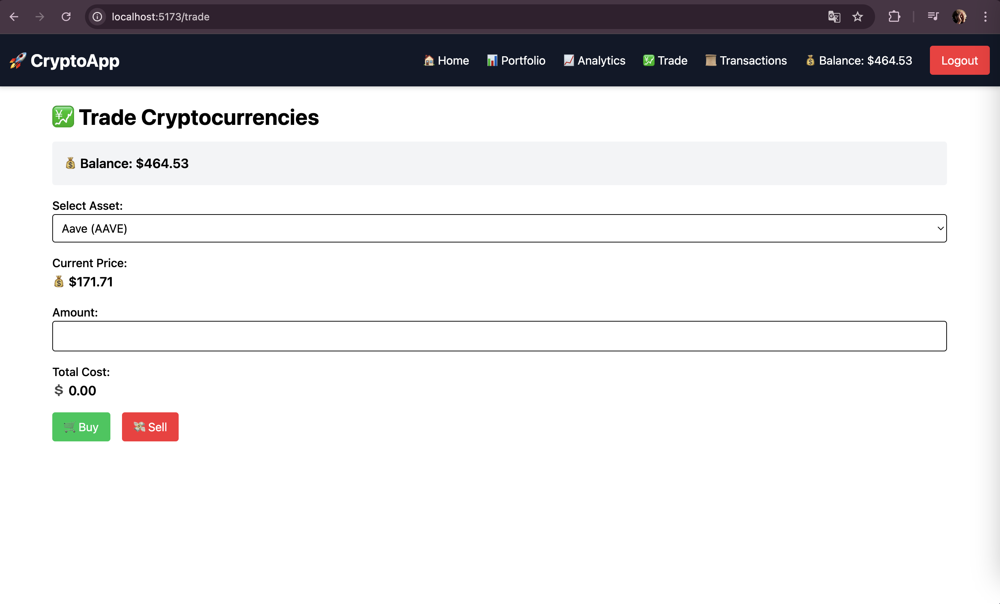

# CryptoApp - Frontend

This is the frontend of a CryptoApp, developed using **React**, **Vite**, **Tailwind CSS**, and **WebSockets**. The platform allows users to trade cryptocurrencies, track their portfolio, and analyze performance.

## Backend Repository

The Backend for this project is available at: [CryptoApp Backend](https://github.com/MarkOmelyanenko/crypto-app-backend)

## Features

- User authentication (JWT-based login and registration)
- Live cryptocurrency price updates via WebSockets
- Portfolio overview
- Buy and sell cryptocurrencies
- Transaction history
- Portfolio analytics with graphical data visualization

## Technologies Used

- **Frontend:** React, Vite, Tailwind CSS
- **State Management:** React Hooks
- **Routing:** React Router
- **API Calls:** Axios
- **Real-time Updates:** WebSockets (Binance API)
- **Data Visualization:** Recharts

## Screenshots

Here are some screenshots of the application:

### Login Page

### Register Page

### Home Page

### Portfolio Page

### Analytics Page

### Trading Page

### Transaction History Page

