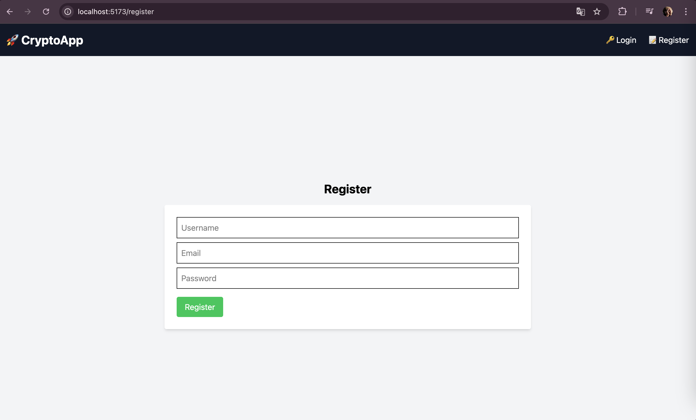

# CryptoApp - Frontend

This is the frontend of a CryptoApp, developed using React, Vite, Tailwind CSS, and WebSockets. The platform allows users to trade cryptocurrencies, track their portfolio, and analyze performance.

## Backend API

The frontend interacts with a Spring Boot backend that handles authentication, trading logic, and real-time data updates.

Backend repository: [CryptoApp Backend](https://github.com/your-username/backend-repo)

## Features

- User authentication (JWT-based login and registration)
- Live cryptocurrency price updates via WebSockets
- Portfolio management with asset tracking
- Buy and sell cryptocurrencies with real-time prices
- Transaction history for tracking past trades
- Portfolio analytics with graphical data visualization
- Responsive design optimized for mobile and desktop

## Technologies Used

- **Frontend:** React, Vite, Tailwind CSS
- **State Management:** React Hooks
- **Routing:** React Router
- **API Calls:** Axios, Fetch API
- **Real-time Updates:** WebSockets (Binance API)
- **Data Visualization:** Recharts

## Getting Started

### Prerequisites

Ensure you have **Node.js** and **npm** (or **yarn**) installed.

### Installation

Clone the repository and install dependencies:

```bash
git clone https://github.com/your-username/your-repo.git
cd your-repo
npm install
```

### Running the Development Server

```bash
npm run dev
```

The application will be available at: `http://localhost:5173/`

### Configuration

Update the API base URL in `api.js` and `socket.js`:

```javascript
const API_BASE_URL = "http://your-backend-url/api";
```

## Screenshots

Here are some screenshots of the application:

### Login Page


### Register Page



### Home Page


### Portfolio Page


### Analytics Page


### Trading Page


### Transaction History Page


